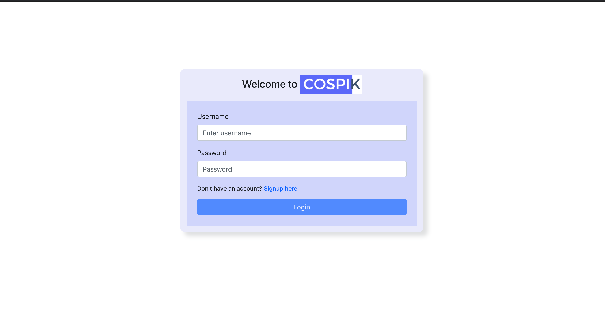

<!-- [](https://www.travis-ci.com/d-beloved/cospik)
[](https://codeclimate.com/github/d-beloved/cospik/test_coverage) -->

<!-- PROJECT LOGO -->
<!-- <br />
<p align="center">
  <a href="https://github.com/d-beloved/cospik">
    
  </a>

  <h3 align="center">A University Admin Application</h3>

  <p align="center">An app that allows a university admin to pick a course for students and so much more</p>
</p> -->

<!-- TABLE OF CONTENTS -->
<!-- <details open="open">
  <summary>Table of Contents</summary>
  <ol>
    <li>
      <a href="#about-the-project">About The Project</a>
      <ul>
        <li><a href="#features">Features</a></li>
        <li><a href="#built-with">Built With</a></li>
      </ul>
    </li>
    <li>
      <a href="#getting-started">Getting Started</a>
      <ul>
        <li><a href="#installation-using-docker">Installation using Docker</a></li>
      </ul>
    </li>
    <li><a href="#usage">Usage</a></li>
    <li><a href="#license">License</a></li>
  </ol>
</details> -->

<!-- ABOUT THE PROJECT -->
<!-- ## About The Project

<p>
  <a href="https://github.com/d-beloved/cospik">
    
  </a>
</p>

Imagine an Admin for a university who wants to manage student course enrollment and unenrollement for a school session seamlessly,
COSPIK is the right solution for you, it offers the following functionality:

### Features
* An admin can signup and login
* List of students can be seen in a paginated table
* New students can be added
* Student name can be edited
* Available courses can be viewed in a paginated table
* New courses can be added to the app
* Courses can be deleted from the app
* A student information showing their enrolled courses can be viewed
* Admin can enroll(add) and unenroll(remove) student for a course

### Built With

* [Typescript](https://www.typescriptlang.org)
* [NodeJs](https://nodejs.org/en/)
* [ExpressJs](https://expressjs.com/)
* [ReactJs](https://reactjs.org/)
* [Redux](https://redux.js.org/)
* [React-Bootstrap](https://react-bootstrap.netlify.app/)
* [Jest](https://jestjs.io/)
* [PostgreSql](https://www.postgresql.org/) -->

<!-- GETTING STARTED -->
<!-- ## Getting Started
  ### Installation using Docker

  * Install [Nodejs](https://nodejs.org/en/download/)
  * Install [Docker](https://www.docker.com/products/docker-desktop) if you don't have it installed on your system
  * Clone this repo
      ```sh
        git clone https://github.com/d-beloved/cospik
      ```
  * check the `.env-sample` files inside `/server` folder and on the `root` of the app, fill the information as required
  * When running the app for the first time, run
      ```sh
        docker-compose up --build
      ```
      to build the images and start the container; for subsequent runs, you need to remove the `--build` flag -->

<!-- USAGE EXAMPLES -->
<!-- ## Usage

Please refer to the [Documentation](https://documenter.getpostman.com/view/2841318/TVzYgEWg) for information on the available APIs -->

<!-- LICENSE -->
<!-- ## License

Distributed under the MIT License. See [MIT License](LICENSE) for more information.

&copy; Ayodeji Moronkeji -->